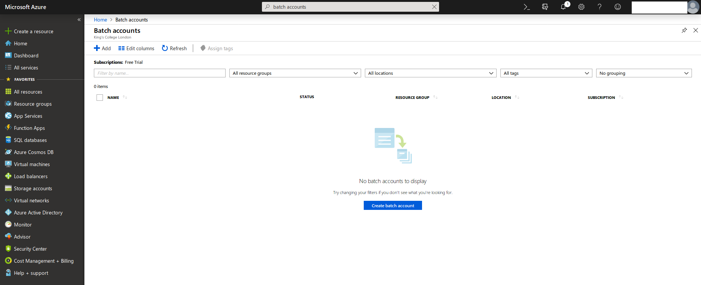
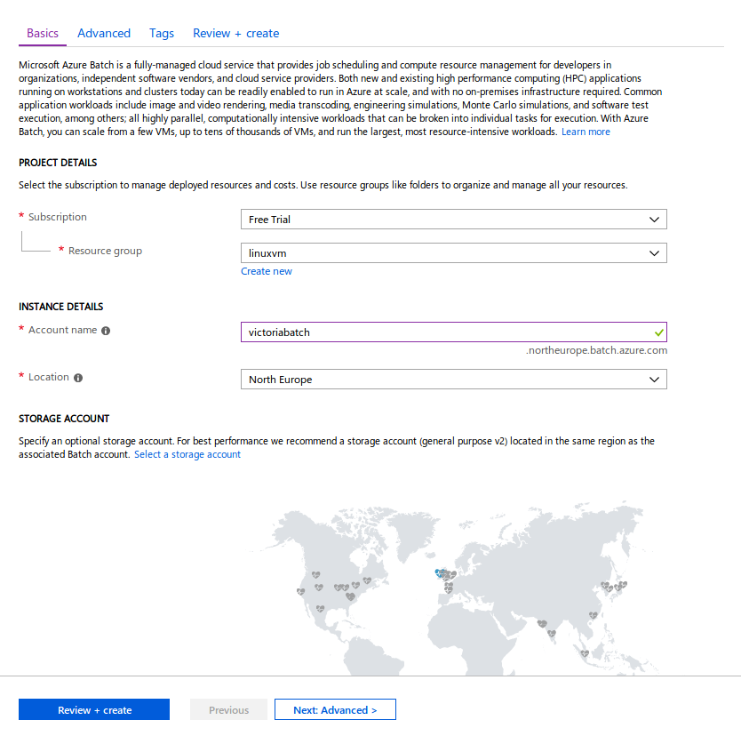
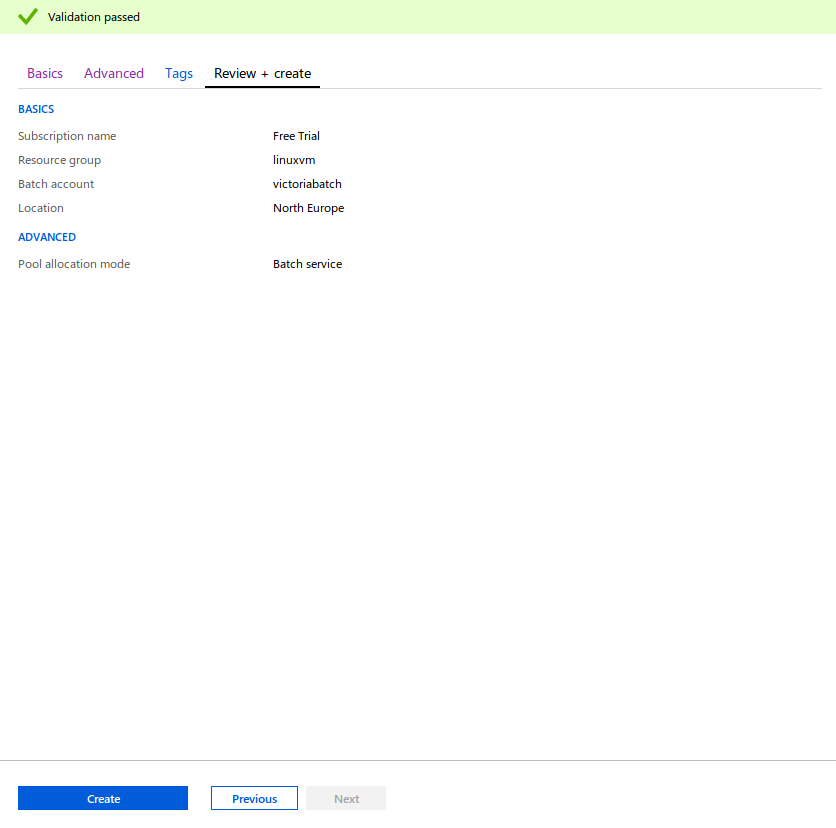
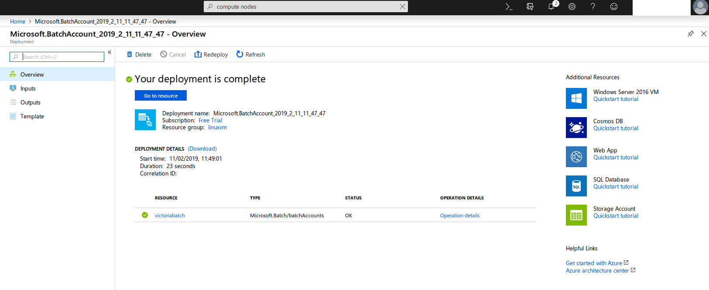
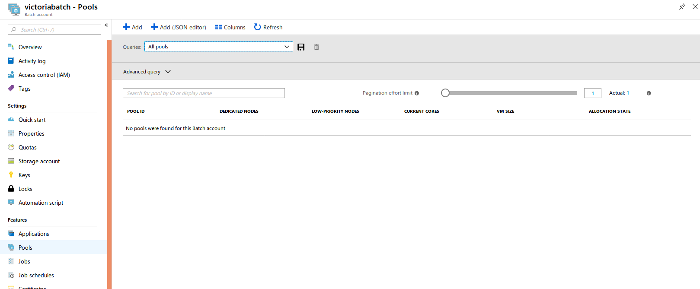
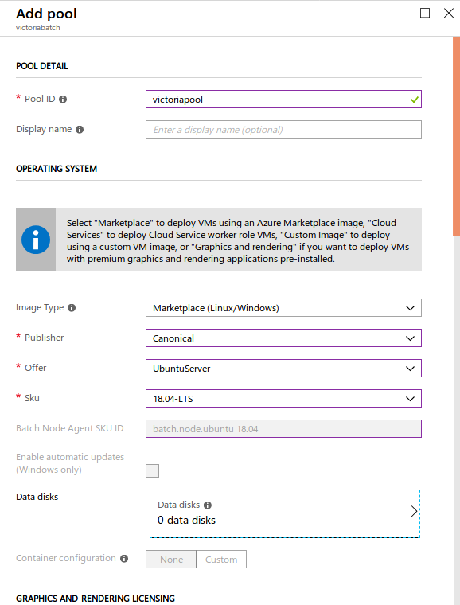
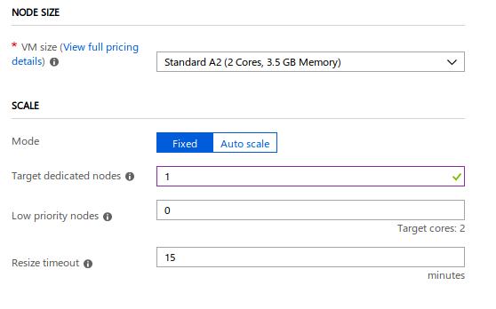
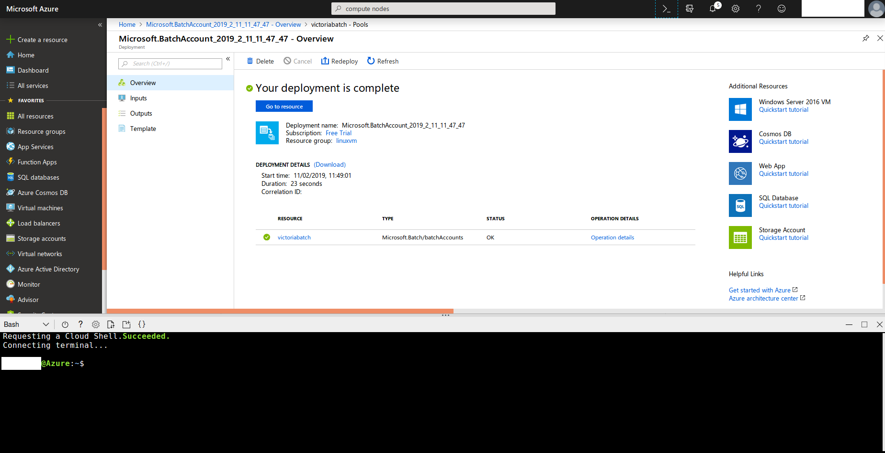

## Introduction to Unix shell in Azure

### Part 1
Have a go at using these basic commands.

[Basic commands](https://github.com/alexeymorgunov/unixshellcourse/blob/master/Notes1.md)

Try and apply them to these exercises.

[Exercises](https://github.com/alexeymorgunov/unixshellcourse/blob/master/Exercises1.md)

[Answers to Exercises](https://github.com/alexeymorgunov/unixshellcourse/blob/master/Exercises1.md)

### Part 2
This goes further into more advanced commands and how to create shell scripts, which you need for running jobs.

[More advanced Unix shell](https://github.com/alexeymorgunov/unixshellcourse/blob/master/Notes2.md)

Try and apply them to these exercises.

[Exercises](https://github.com/alexeymorgunov/unixshellcourse/blob/master/Exercises2.md)

[Answers to Exercises](https://github.com/alexeymorgunov/unixshellcourse/blob/master/Answers2.md)

## Batch Jobs in Azure

Read about batch jobs [here](https://docs.microsoft.com/en-us/azure/batch/batch-technical-overview).

#### Create a Batch Account

Search `batch account` in Search resources, services and docs.



In Basics, select `linuxvm` in Resource group and create an Account name in North Europe.



In Advanced, keep default option to `Batch service`.

In Tags, add `Workshop` in NAME and `Linux` in VALUE.

In Review + create, once Validation has passed, click Create. This should deploy in about 30 seconds.



Once deployed, click `Go to resource`.



Click on `Pools` under Features.



Click next. Create an ID name for `Pool ID`, select `Canonical` for Publisher, `UbuntuServer` for Offer, and `18.04-LTS` for Sku.



Scroll down. Select `Standard A2 (2 Cores, 3.5 GB Memory)` for VM size and `1` for Target dedicated nodes. Leave other options. Click OK. This may take a few minutes to Resize until the allocation state is `Steady`.



Now, click on `Cloud Shell` or the `>_` symbol to launch the command line.



Now you are going to run a simple batch job!

Login to your batch account
```bash
az batch account login --name <your batch account name> --resource-group linuxvm --shared-key-auth
```

Create a job
```bash
az batch job create --id myjob --pool-id <your pool id>
```

Next, deploy a task where you print "Hello, world!"
```bash
az batch task create --task-id mytask --job-id myjob --command-line "/bin/bash -c 'echo Hello, world!'"
```

Print the output of the file locations.
```bash
az batch task file list --job-id myjob --task-id mytask --output table
```
You should get something like this:


Download the output of the task.
```bash
az batch task file download --job-id myjob --task-id mytask --file-path stdout.txt --destination ./stdout.txt
```

Look at the contents of the file
```bash
cat stdout.txt
```


You can also run jobs in parallel. Here we run four jobs. This will run concurrently in batches of 2 (as we requested a pool of two cores). Each core can run one job. Here is a bash script that is running the command to print "Hello, world" and the task number.
```bash
#!/bin/bash

for i in {1..4}
do
   az batch task create \
    --task-id mytask$i \
    --job-id myjob \
    --command-line "/bin/bash -c 'echo Hello, world $i!'"
done
```

You can read more on how to create Batch jobs [here](https://docs.microsoft.com/en-us/azure/batch/).

#### License
Some material has been taken from [Unix shell course](https://github.com/alexeymorgunov/unixshellcourse) under a CC-BY-NC-SA license.
